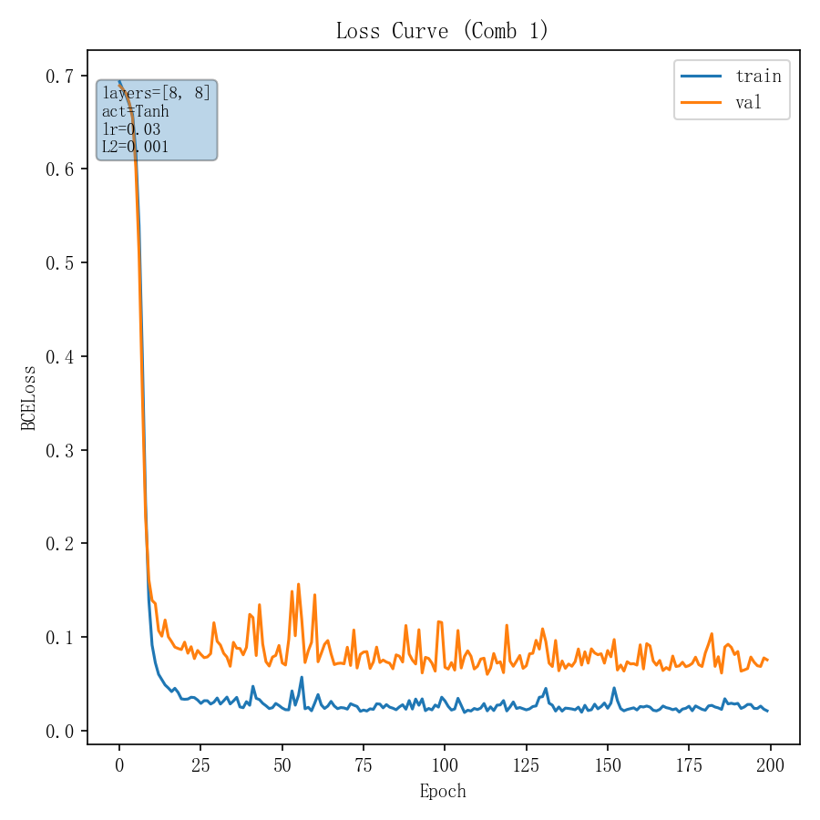
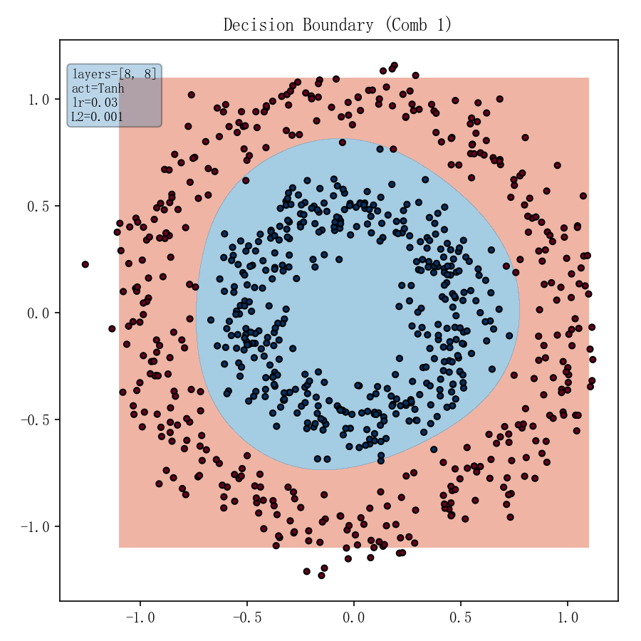
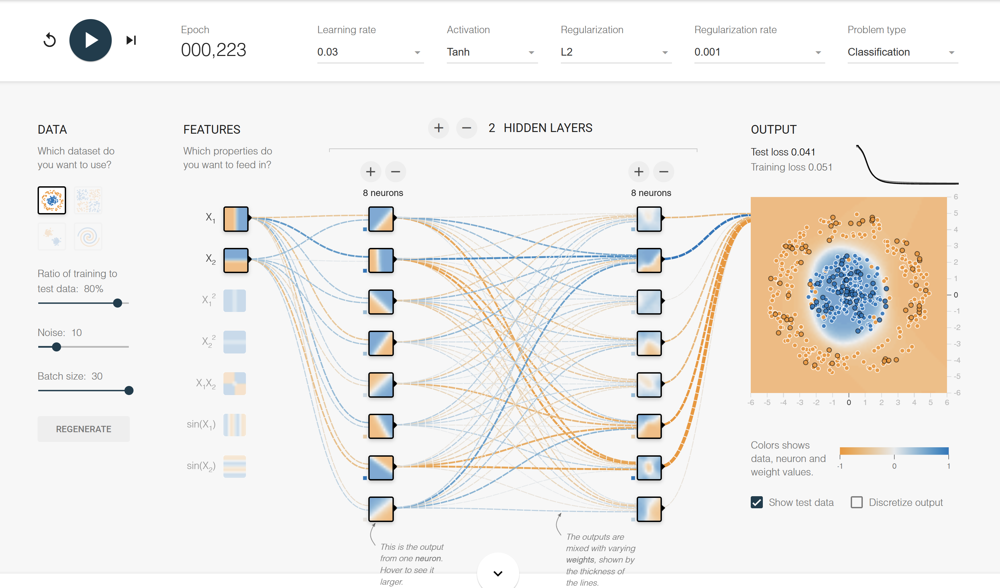
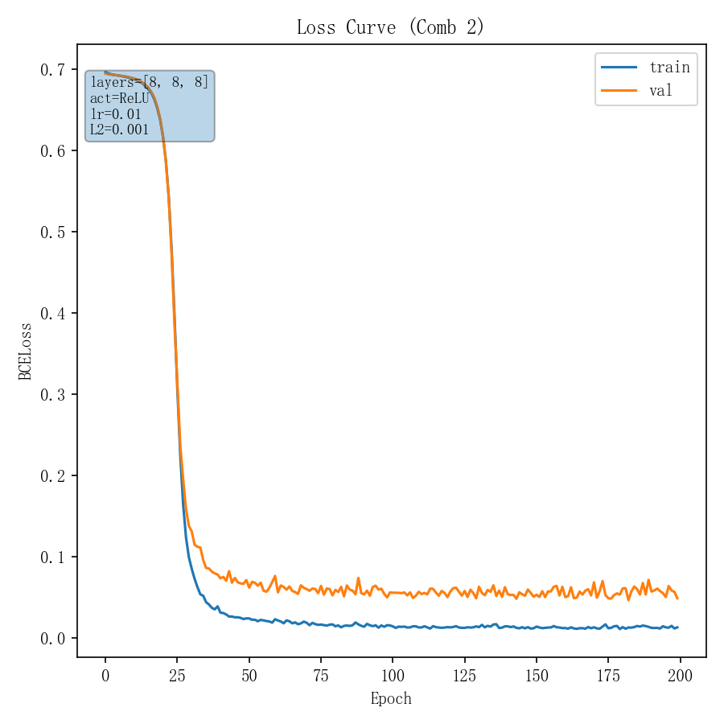
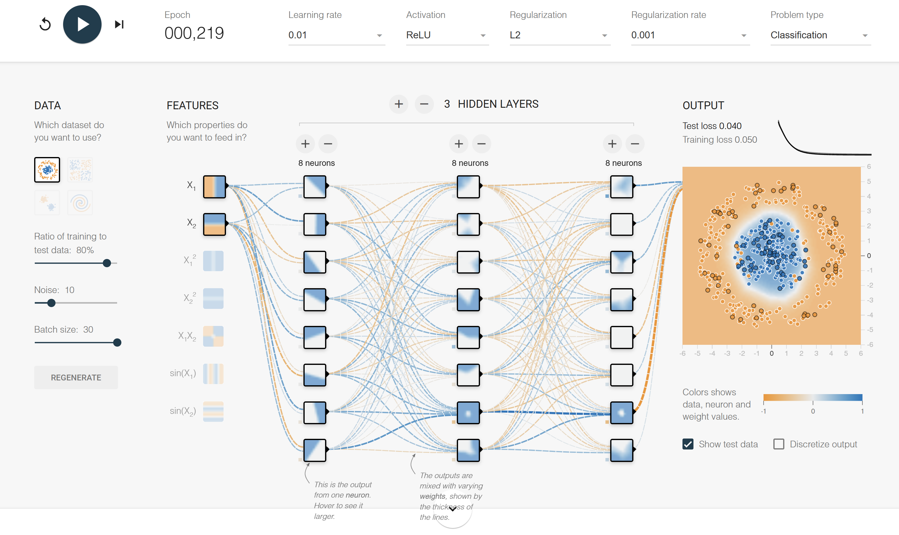
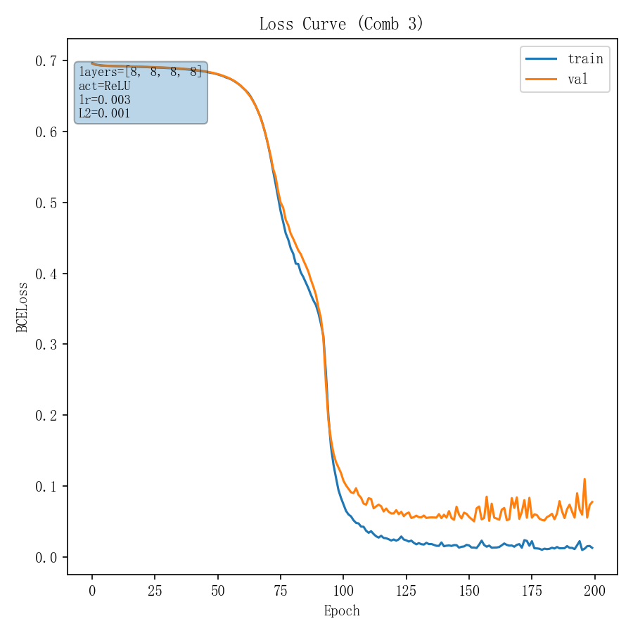
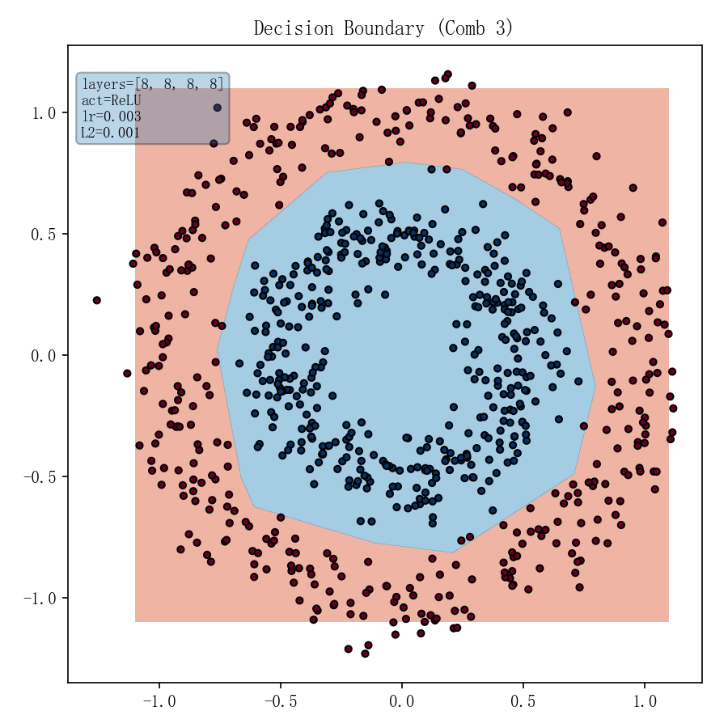
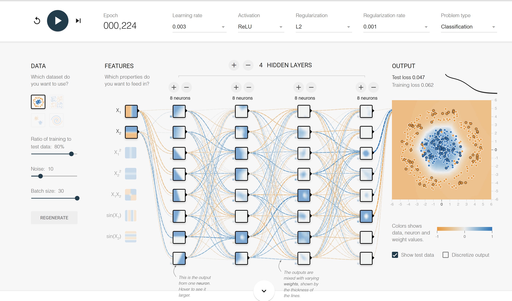

<!-- _class: cover_a -->
<!-- _header: "" -->
<!-- _footer: "" -->
<!-- _paginate: "" -->

# 机器学习及其航空动力应用  
###### 第三次作业 PyTorch 本地 vs. TensorFlow Playground 对比  

BY2405316 严五金  
<moxiyan@buaa.edu.cn>  
2025 年 5 月 1 日  


## 参数组合概览

| 组合 | 隐藏层 (units)             | 激活    | 学习率 | L2 正则化 λ |
|:----:|:---------------------------|:--------|:------:|:-----------:|
| **1** | [8, 8] (2 层)              | Tanh    | 0.03   | 0.001       |
| **2** | [8, 8, 8] (3 层)           | ReLU    | 0.01   | 0.001       |
| **3** | [8, 8, 8, 8] (4 层)        | ReLU    | 0.003  | 0.001       |


## 组合 1 本地结果

**参数**: `[8, 8]`，Tanh，lr=0.03，L2=0.001  
**终端输出摘要**:
```

Epoch  50/200: train=0.0265, val=0.0907
Epoch 100/200: train=0.0354, val=0.1152
Epoch 150/200: train=0.0292, val=0.0718
Epoch 200/200: train=0.0209, val=0.0754

```

---

<!-- _class: cols-2-notitle -->

<div class="limg">



</div>

<div class="rimg">



</div>

---

#### Playground 组合 1  




## 组合 2 本地结果

**参数**: `[8, 8, 8]`，ReLU，lr=0.01，L2=0.001  
**终端输出摘要**:
```

Epoch  50/200: train=0.0239, val=0.0711
Epoch 100/200: train=0.0152, val=0.0559
Epoch 150/200: train=0.0118, val=0.0505
Epoch 200/200: train=0.0128, val=0.0487

```

---

<!-- _class: cols-2-notitle -->

<div class="limg">



</div>

<div class="rimg">


</div>

---

#### Playground 组合 2  




## 组合 3 本地结果

**参数**: `[8, 8, 8, 8]`，ReLU，lr=0.003，L2=0.001  
**终端输出摘要**:
```

Epoch  50/200: train=0.6815, val=0.6819
Epoch 100/200: train=0.0834, val=0.1185
Epoch 150/200: train=0.0171, val=0.0608
Epoch 200/200: train=0.0129, val=0.0776

```

---

<!-- _class: cols-2-notitle -->

<div class="limg">



</div>

<div class="rimg">



</div>

---

#### Playground 组合 3  




## 总结

- 三组配置均满足 ≤6 层、≤8 单元/层  
- 组合 1、2 快速收敛；组合 3 前期学习慢但仍收敛
- PyTorch 本地与 Playground 可视化高度一致  
- 适当增大学习率与 L2 正则可提高收敛稳定性  

---

<!-- _class: lastpage -->
<!-- _footer: "" -->
###### 感谢！

<div class="icons">

  <div class="icon-item">
    <i class="fa-solid fa-envelope"></i>
    <span>moxiyan@buaa.edu.cn</span>
  </div>
  
  <div class="icon-item">
    <i class="fa-brands fa-weixin"></i>
    <span>dreamseeker_626</span>
  </div>
  
  <div class="icon-item">
    <i class="fa-solid fa-house"></i>
    <span>SH2-B216</span>
  </div>

</div>