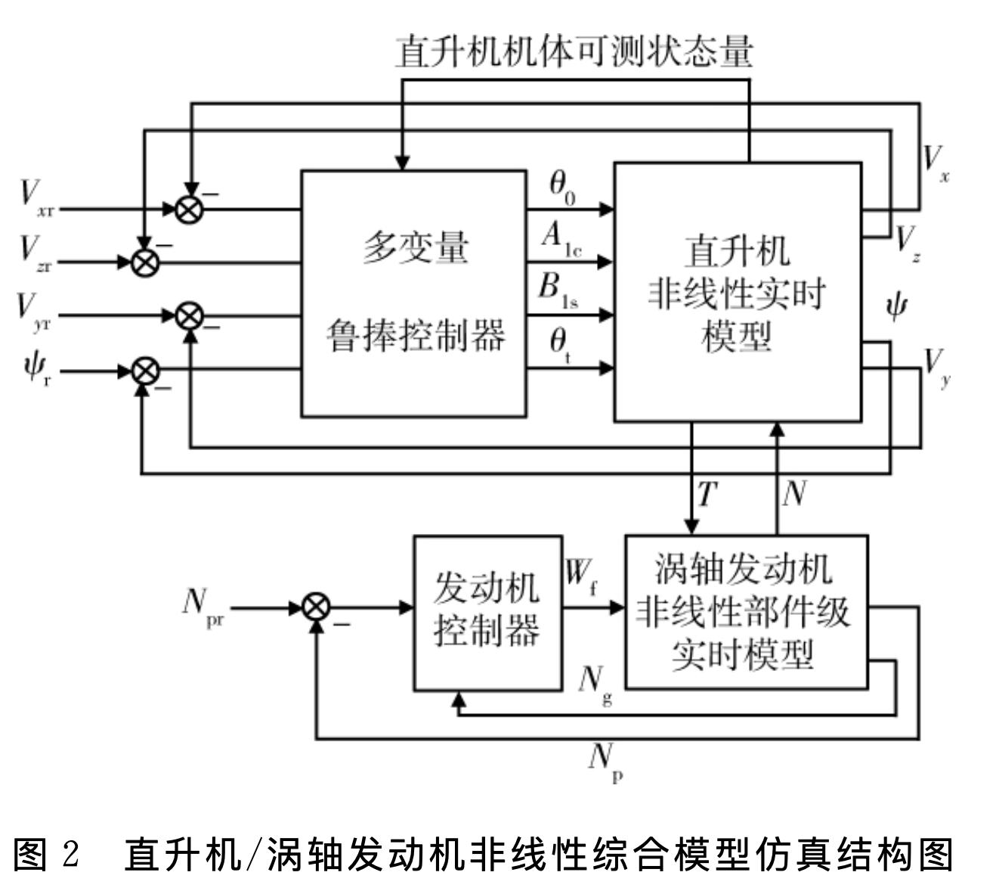
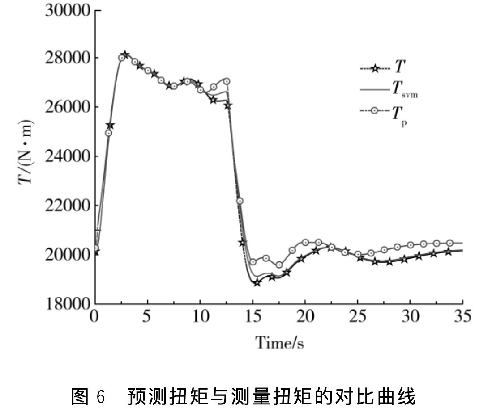

<!-- _class: cover_a -->
<!-- _header: "" -->
<!-- _footer: "" -->
<!-- _paginate: "" -->

# 机器学习及其航空动力应用
###### 第二次作业

BY2405316 严五金  
<moxiyan@buaa.edu.cn>  
2025 年 4 月 1 日

## 《Classifying Induced Damage in Composite Plates Using One-Class Support Vector Machines》 文献分析
<!-- _class: trans -->
<!-- _footer: "" -->
<!-- _paginate: "" -->

## 工程问题：复合材料损伤检测

**背景:**
*   纤维增强复合材料在航空航天等领域应用广泛，但易产生复杂损伤（疲劳、过载、冲击等）。
*   损伤影响结构性能和可靠性，甚至导致灾难性故障。
*   迫切需要高效、经济的诊断方案来检测、表征和评估损伤。

**价值:**
*   提高复杂系统性能、可靠性，延长结构使用寿命。
*   实现结构健康监测 (SHM)。

---

**研究思路:**
*   采用主动传感方法：利用压电致动器激励结构，通过表面压电传感器测量传播波信号的变化。
*   损伤会改变波的传播特征（衰减、反射、谐波等）。

*图 10: 实验设置示意图*

## 问题转化：工程问题 -> SVM分类问题

**核心思想:**
结构中的损伤（如分层、孔洞、切口等）会改变传感器测量的波信号特征。将识别这些变化的信号特征视为一个模式识别/异常检测问题。

---
**转化路径:**
1.  **特征提取:** 从传感器测量的原始时域信号中提取能够表征损伤状态的特征。
    *   时域特征
    *   时频域特征 (Gabor谱图)
    *   **时间嵌入 (Time-embedding)** (效果更优)
2.  **模型应用:** 利用机器学习算法（特别是OC-SVM）对提取特征分类。
    *   区分“健康”与“损伤”状态。
    *   区分不同类型的损伤状态。
3.  **目标:** 构建一个分类器，能够根据传感器信号特征自动判断结构是否存在损伤以及损伤的类型。

## 数据获取：实验设计与数据采集 (1/2)

**实验对象:**
*   16层碳纤维氰酸酯环氧树脂复合材料板 ($[0/90]_{4s}$ 层压板)。
*   尺寸: $30.5 \times 5.1 \times 0.281$ cm，悬臂梁设置。
*   损伤类型: 健康、分层、钻孔、缺口、锯切 (尺寸见原文Table 2)。

**传感系统:**
*   致动器/传感器: Thunder压电传感器 (PZT)。
*   布局: 致动器位于固定端，传感器1和2分别距致动器9.5 cm和19 cm。

## 数据获取：实验设计与数据采集 (2/2)

**激励与采集:**
*   激励信号: 8 kHz 中心频率的4.5周期 Hanning 窗正弦脉冲信号 (50V峰峰值)。(频率基于有限元分析和扫频测试选择)，采样率: 100 kHz。
*   数据量: 5种状态，每种状态2个试件，每个传感器至少10次观测，共计每类40个信号向量用于分类。考虑了材料和实验不确定性。

**数据预处理:**
*   **时间嵌入:** 使用 Taken 定理从标量时间序列重构状态空间吸引子。设置嵌入维度 $N_d=11$, 时间延迟 $\tau=1$。 (Case 2 & 3)
*   **时频分析:** Gabor 谱图。(Case 1)

## 模型选择：单类支持向量机 (OC-SVM)

**核心模型:** One-Class Support Vector Machine (OC-SVM)
*   **特点:** 属于SVM家族的特殊成员，主要用于异常检测。
*   **原理:** 仅使用“正常”或“目标”类别的数据进行训练，在特征空间中找到一个超平面，将该类数据与原点或其他区域最大间隔地分开。
*   **优势:**
    *   适用于只有一类样本充足（如健康状态）的情况。
    *   能有效处理高维数据。
*   **核函数:** 径向基函数 (RBF) 核 $K(\mathbf{x}, \mathbf{x}_i) = \exp(-\frac{1}{2\sigma^2} \|\mathbf{x} - \mathbf{x}_i\|^2)$，因其良好性能被选用。

---
**图 4: OC-SVM 最优超平面示意图**

## 模型训练：参数调优技巧 (1/2)

**训练算法:**
*   基于 Schölkopf 等人提出的OC-SVM算法。
*   求解一个二次规划对偶问题来找到支持向量和决策边界。
    $$ \min_{\alpha} \frac{1}{2} \sum_{i,j} \alpha_i \alpha_j K(\mathbf{x}_i, \mathbf{x}_j) \quad \text{s.t.} \quad 0 \le \alpha_i \le \frac{1}{lv}, \sum \alpha_i = 1 $$

**关键超参数:**
*   $v$: 训练误差分数的上界，控制着模型对异常值的容忍度。实验中设为 $v = 0.05$。
*   $\sigma$: RBF核函数的宽度参数，控制决策边界的平滑度。

## 模型训练：参数调优技巧 (2/2)

**$\sigma$ 调优方法 (Unnthorsson et al. [42]):**
1.  固定 $v$ (例如 0.05)。
2.  在一系列 $\sigma$ 值上训练模型。
3.  绘制训练数据的正确分类率随 $\sigma$ 变化的曲线。
4.  选择使分类率**首次**达到目标最高准确率 $(1-v)$ 的 $\sigma$ 值作为最优 $\sigma$。

---
**图 3: 最优 $\sigma$ 选择方法示意图**

## 评价指标：如何衡量模型效果

**主要指标:**
*   **正确分类率 (Correct Classification Rate):** 在测试集上评估分类准确性。
    *   使用 $R_{ij}$ 矩阵表示：用第 $i$ 类数据训练的模型，对第 $j$ 类测试数据的正确分类率。

**类别判定准则:**
*   判断类别 $i$ 和 $j$ 是否属于同一类 (用于多类分类任务):
    *   计算 $R_{ij}$ 和 $R_{ji}$。如果 $|R_{ij} - R_{ji}| \le 0.05(1 - v)$，则认为类别 $i$ 和 $j$ 相似，记 $Q_{ij} = Q_{ji} = 1$，否则为 0。

---

**多传感器信息融合:**
*   结合两个传感器 (s1, s2) 的结果：$M = Q^{s1} \cap Q^{s2}$。
*   最终分类结果矩阵 $M$ 中，$M_{ij}=1$ 表示基于两个传感器的信息，类别 $i$ 和 $j$ 被判定为同一类。理想情况下，只有对角线元素为 1。

**异常检测性能 (模拟数据):**
*   混淆矩阵 (Confusion Matrix)
*   误报率 (Probability of False Alarm)
*   检测率 (Probability of Detection)

**对比基准:**
*   k-最近邻 (k-NN) 算法 ($k=30$)。

## 使用效果：性能评估与对比 

**作者自评 (模拟数据):**
*   OC-SVM结合时间嵌入特征能有效检测信号中的异常模式（反射、突发信号），即使存在噪声。

**作者自评 (真实数据):**
*   **特征对比:** 时间嵌入特征优于时频特征 (Gabor谱图)，分类效果更好 (Table 5 vs Table 8)。

---

**图 19: OC-SVM 与 k-NN 性能对比**

## 使用效果：性能评估与对比 
**作者自评 (真实数据 续):**
*   **多传感器融合:** 结合两个传感器的信息和判别准则，能有效区分所有五种状态（健康及四种损伤），并考虑了材料和实验不确定性 (Table 11)。
*   **鲁棒性:** 多传感器融合和判别准则提高了分类的准确性，减少了误分类。

**与k-NN对比:**
*   在相同的测试集上（使用时间嵌入特征），OC-SVM 的分类正确率优于 k-NN ($k=30$) 算法 (Fig. 19)。

*图 19: OC-SVM 与 k-NN 性能对比*

---
**结论:**
*   提出了一种基于OC-SVM的新方法，能有效评估和分类复合材料板中的诱发缺陷。
*   时间嵌入特征与OC-SVM结合效果显著。
*   利用多传感器信息融合可提高分类鲁棒性和准确性。
*   该方法相比基于分解的技术（如小波、匹配追踪）在初步检测异常模式方面计算成本可能更低。

## 《基于支持向量回归机的发动机/直升机 扭矩超前控制》 文献分析

<!-- _class: trans -->
<!-- _footer: "" -->
<!-- _paginate: "" -->

## 工程问题：涡轴发动机转速控制与扰动抑制

**背景:**
* 直升机高机动性要求导致发动机与旋翼系统耦合增强。
* 机动飞行（如快速爬升/下降）时旋翼系统所需扭矩发生剧烈变化。
* 对于旋翼转速恒定的涡轴发动机，变化扭矩是一个强烈的外部扰动。
* 传统的控制方法难以完全抑制，导致发动机功率涡轮转速出现较大的下垂或超调，影响飞行品质和发动机稳定性。
* 直接测量旋翼扭矩进行补偿是一种思路，但由于旋翼的非定常气动特性和测量装置的延迟，实测扭矩信号相对于实际需求存在滞后，限制了补偿效果。

---

**价值:**
* 提高直升机/发动机综合系统的控制品质和操纵性。
* 更有效地抑制扭矩扰动对发动机转速的影响，减小功率涡轮转速的下垂/超调量。
* 充分挖掘直升机机动潜力，提升任务适应性。
* 实现更稳定的发动机工作状态，满足飞行员对功率需求的快速响应。

## 问题转化：工程问题 -> SVR回归预测问题

**核心思想:**
既然实测扭矩存在滞后，无法完全满足实时补偿的需求，那么就尝试*预测*未来的扭矩。如果能提前知道未来一段时间内旋翼所需的扭矩大小和变化趋势，就可以将这个预测值作为前馈信号输入发动机控制器，提前调整燃油供给，从而更有效地抑制转速波动。

---
**转化路径:**
1.  **扭矩估计模型:** 首先，需要建立一个能够根据当前和过去的飞行状态（高度、速度等）及操纵输入（总距、周期变距等）实时*估计*当前旋翼扭矩的模型。这被视为一个非线性动态系统的辨识问题。
2.  **扭矩预测机制:** 基于这个实时估计模型，通过迭代或某种预测机制，利用当前和过去的输入/状态信息，以及（如果可用）未来短时间内的操纵指令（假设已知或可以预测），来*预测*未来 $N$ 个时间步后的旋翼扭矩值。
---
3.  **模型应用:** 将这个预测得到的未来扭矩值 $T_p$ (以及其变化率，即微分信号) 作为前馈补偿信号，输入到涡轴发动机的控制器中（具体是补偿到内环燃气涡轮转速指令上）。
4.  **目标:** 将工程上的“抑制转速波动”问题，转化为机器学习中的“基于历史和当前数据预测未来扭矩”的回归问题，并利用该预测结果优化控制策略。

## 数据获取：仿真实验与数据采集

**数据来源:**
* 数据并非来自真实飞行试验，而是通过一个高置信度的**直升机/涡轴发动机综合系统实时仿真平台**生成。
* 该平台包含基于 UH-60A 直升机数据的非线性、非定常实时模型（含主旋翼、机身、尾桨等模块）和基于 T700 发动机数据的非线性部件级模型。

---

---

**数据生成方式:**
* **覆盖飞行包线:** 在不同高度（如 0.9, 1.0, 1.1 km）和不同前飞速度（0 到 75 m/s，间隔 5 m/s）的组合点上进行仿真。
* **动态数据采集:** 在每个包线点上，模拟典型的机动操作，即直升机爬升速度 $V_z$ 指令的阶跃变化（例如，从 0 m/s 变为 6 m/s，一段时间后再变回 0 m/s）。在这些动态过程中采集数据。
---
* **输入与输出:**
    * **输入 (Features):** 扭矩*估计*模型的输入包括当前及过去若干步的：高度 $H$, 前飞速度 $V_x$, 爬升速度 $V_z$, 旋翼总距 $\theta_0$, 纵向周期变距 $B_{1s}$, 横向周期变距 $A_{1c}$, 功率涡轮转速 $N_p$。历史步数 $N_1, \dots, N_8$ 通过调试法确定。
    * **输出 (Target):** 扭矩*估计*模型的目标输出是当前时刻的旋翼扭矩 $T$（由仿真模型计算得到，视为“实测值”）。
* **数据量:** 文中没有明确给出训练样本的总数量，但提到了训练是在三个高度、多个速度点上进行的动态过程数据，并且训练得到的支持向量个数为 1000 个。测试数据则是在训练包线内的其他点上生成的动态数据。

---

**特殊操作:**
* 使用仿真模型输出的扭矩作为“实测值”进行训练和测试，未考虑真实扭矩传感器的测量误差。
* 通过仿真遍历 $H-V_x-V_z$ 三维空间，以确保模型能覆盖直升机纵向平面内的主要飞行状态。

## 模型选择：迭代约简最小二乘支持向量回归机 (RR-LSSVR)

**核心模型:** Iterative Reduced Least Squares Support Vector Regression (RR-LSSVR)，是标准 LSSVR (Least Squares Support Vector Regression) 的一种改进算法。
* **选择理由:**
    * 良好的泛化能力。
    * 避免陷入局部最优（相对于神经网络）。
    * 通过约简和迭代提高了实时性，适合在线估计/预测任务。
    * 已有成功应用于航空发动机推力估计的先例。
---
* **原理:**
    * 继承了 SVR/LSSVR 基于统计学习理论、结构风险最小化、使用核函数（本文选用高斯核 $K(\mathbf{x}_i, \mathbf{x}_j) = \exp(-\|\mathbf{x}_i - \mathbf{x}_j\|^2 / 2\gamma^2)$）处理非线性的优点。
    * 引入了**约简技术 (Reduced Set)** 和 **迭代策略**：
        * **约简/稀疏性:** 不使用所有训练样本来构建模型，而是选择一个有代表性的子集（支持向量），提高了计算效率和实时性。
        * **迭代选择:** 迭代地将对目标函数贡献最大的非支持向量加入支持集，并利用 Cholesky 分解更新解。这考虑了非支持向量的约束，相比其他稀疏化方法，在相同支持向量数目下通常有更好的泛化能力。

---
* **联用:** 该 RR-LSSVR 模型用于构建基础的单步扭矩*估计*器 $T_{(k)} = f(X_{(k)})$。然后基于这个估计器，通过迭代方式构建多步*预测*模型 $T_{(k+N)} = F(\bar{X})$ (SVMP, Support Vector Machine Prediction)，如公式(2)和(3)所示。

## 模型训练：参数调优技巧

**训练算法:**
* RR-LSSVR 算法，其核心是迭代选择支持向量并更新模型参数。

**关键超参数及选择:**
* **核参数 $\gamma$ (Gaussian Kernel Width):** 文中直接给出了选定值 $\gamma = 0.22$。没有详细说明如何选择这个值（例如通过网格搜索、交叉验证等），但通常这个参数对模型性能影响很大，可能通过实验调试获得。
* **正则化参数 $C$:** LSSVR 中对应的是正则化参数，文中给出了一个非常大的值 $C = 2^{25}$。这表明模型倾向于拟合训练数据（在 LSSVR 中，大的 C 意味着对误差的惩罚更大）。同样，没有说明选择过程。

---
* **支持向量个数:** 通过 RR-LSSVR 算法的迭代过程确定，文中设定目标为 1000 个支持向量。
* **历史信息步数 ($N_1$ to $N_8$):** 用于构建输入特征向量，文中提到是“通过仿真用调试法选取”，目标是平衡动静态估计精度和参数数量。
* **预测步数 $N$:** 用于扭矩预测 $T_{(k+N)}$，文中设定为 $N=15$。这个值的选择基于需要抵消的系统滞后时间（扭矩测量滞后 + 操纵对扭矩影响的滞后），目标是提供足够的前置时间（约 50ms），并通过仿真反复调试以获得最佳的控制效果。
* **PD 补偿器参数 ($k_p, k_d$):** 这是控制器的参数，而非 SVR 模型本身的参数。文中给出 $k_p = 0.1362, k_d = 0.02$，是通过在综合仿真模型中“反复调参”得到的，目标是优化最终的转速控制性能。
---
**总结:** 对于 SVR 模型本身的超参数 ($\gamma$, C, 支持向量数)，文中给出了最终值但未详述调优过程。对于应用相关的参数（历史步数、预测步数、补偿器增益），主要依赖基于仿真平台的实验调试和性能评估来确定。

## 评价指标：如何衡量模型效果

**主要指标:**
1.  **扭矩估计/预测精度:**
    * **相对误差:** 计算估计/预测扭矩值与仿真模型输出的“实测”扭矩值之间的相对误差百分比 ($\frac{|T_{estimated} - T_{actual}|}{|T_{actual}|} \times 100\%$)。文中展示了训练数据和测试数据的相对误差曲线 (图 4, 图 5)，要求误差在可接受范围内（如测试误差 < 1.5%，包线内 < 8%）。
    * **绝对量跟踪曲线:** 对比预测/估计扭矩与实测扭矩的时间历程曲线，看吻合程度，尤其关注变化趋势和速率的捕捉能力 (图 5, 图 6)。
---
2.  **预测超前性:**
    * **相位对比:** 通过对比预测扭矩 ($T_p$) 和实测扭矩 ($T$) 的时间曲线，定性或定量评估预测信号相对于实测信号的相位提前量 (图 6)。
3.  **最终控制性能:**
    * **功率涡轮转速下垂量/超调量 ($\Delta N_p / \%$):** 这是评估整个控制方案有效性的核心指标。在模拟机动飞行（如 $V_z$ 阶跃）时，测量功率涡轮转速偏离其额定值的最大百分比 (图 7, 表 2)。下垂/超调量越小越好。
    * **转速恢复时间:** (虽然文中图表主要显示下垂量，但通常也会关注) 转速偏离后恢复到允许范围内所需的时间。越短越好。

---
**对比基准:**
* 将基于 **预测扭矩 ($T_p$)** 补偿的控制方案与以下方案进行对比：
    * **传统方案:** 串级 PID + **总距 ($\theta_0$)** 线性前馈补偿 (Baseline)。
    * **改进方案:** 串级 PID + **实测扭矩 ($T$)** 前馈补偿 (作为中间对比，验证预测的价值)。

## 使用效果：性能评估与对比

**作者自评:**
* **扭矩估计模型 (RR-LSSVR):**
    * 精度高：训练相对误差 < 1.4%，测试相对误差 < 1.5% (特定点)，包线内动态估计相对误差均不大于 8%。
    * 泛化能力强：在未直接用于训练的测试点上仍能保持较好的估计精度。
    * 实时性好：满足在线应用需求（单个子步计算耗时 < 0.5 ms）。

* **扭矩预测模型 (SVMP):**
    * 有效性：能够提供比实测扭矩更早的扭矩变化信息，尤其在操纵量变化剧烈时，相位提前明显 (图 6)。

---

---

* **整体控制方案 (PID + 预测扭矩补偿):**
    * 显著改善性能：相比传统的总距前馈补偿方案，能有效降低直升机机动飞行中功率涡轮转速的下垂量或超调量。
    * 量化效果：在多个飞行包线点上的仿真结果显示，转速下垂量降低幅度普遍在 10% 以上，在一个具体算例中降低了 37.25% (图 7, 表 2)。
    * 优于实测扭矩补偿：结果表明，使用预测扭矩比使用（滞后的）实测扭矩进行补偿效果更好。
    * 工程价值：认为该控制方案具有重要的工程应用价值。

---

**与别的方法进行对比:**
* **主要对比对象:** 传统的“串级 PID + 总距线性前馈补偿”方法。
* **次要对比对象:** “串级 PID + 实测扭矩前馈补偿”方法。
* **对比结果:** 本文提出的基于 RR-LSSVR 预测扭矩的补偿方法在抑制发动机转速波动方面，效果显著优于上述两种对比方法 (如图 7 和 表 2 所示)。

**结论:** 作者认为所提出的方法是成功的，RR-LSSVR 能够精确且实时地估计扭矩，基于此建立的预测机制能有效提供超前信息，结合 PD 补偿器，显著提升了直升机/发动机综合系统在机动飞行时的转速控制品质。